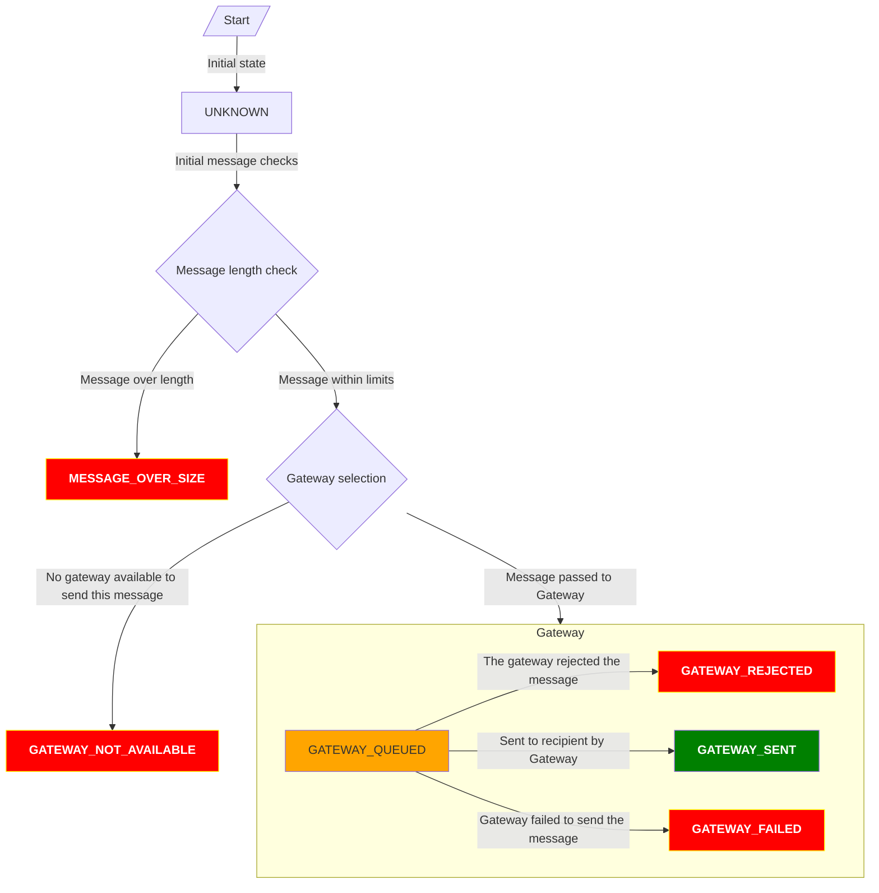

<Since version="4.5" issueNumber="MDL-79808" />

The SMS API lets you send SMS messages using configured gateways, fetch messages that were previously sent, and check on their status.

## Sending an SMS

Messages can be sent using the `send()` method of the SMS Manager class, which should be fetched using Dependency Injection, for example:

```php title="Sending a message"
$message = \core\di::get(\core_sms\manager::class)
    ->send(
        recipientnumber: '+61987654321',
        content: 'This is the content of the message',
        component: 'mod_example',
        messagetype: 'demonstrationmessage',
        recipientuserid: $user->id,
        issensitive: false,
        async: false,
        gatewayid: 22,
    );
```

:::info Message lengths

A single SMS sent by the API may consist of up to 480 UTF-8 characters. It is up to the message _gateway_ plugin to determine how this message is sent to the recipient.

Any message longer than the maximum length will be immediately rejected.

:::

### Sending messages containing sensitive information

When sending a message containing something like a 2FA login token, you should make use of the `issensitive` flag.

Passing this flag prevents the SMS subsystem from storing the content of the message in the message log.

The `send()` method return an instance of `\core_sms\message` which can be used to check on the message status.

## Fetching messages

Every sent message is stored in the database for subsequent reporting, and to check statuses.

Messages can be fetched from the database by calling the `\core_sms\manager::get_message()` and `\core_sms\manager::get_messages()` methods and supplying a filter.

```php title="Fetching messages"
$message = \core\di::get(\core_sms\manager::class)
    ->get_message(['id' => $id]);

$messages = \core\di::get(\core_sms\manager::class)
    ->get_messages(['recipientuserid' => $userid]);
```

:::note Sensitive content

If the message was sent with the `issensitive` flag the message body will not be stored.

:::

## Checking the status of a message

Once a message is sent, a status is recorded against it. This can be used to determine whether the message was sent successfully.

:::info

The level of status information available will depend on individual message gateways and recipient regions. In some regions delivery status may be available, but not in others.

:::

Message status can be checked using the `\core_sms\message::$status` property.

Statuses are represented by a PHP Enum object with each status having a translatable description, and methods to determine whether the message was sent, is failed, or still in-progress.

```php title="Checking the status of a message"
$message = \core\di::get(\core_sms\manager::class)
    ->get_message(['id' => $id]);

// Check if the message is failed.
$message->is_failed();

// Check if the message is still in transit.
$message->is_in_progress();

// Check if the message is sent.
$message->is_sent();

// Get the description of the state.
$message->description();
```



## Getting the list of SMS gateways

Once the gateway is configured from UI, any component implementing the core_sms API can get the list of gateways. The list can also be filtered.

```php title="Getting the list of enabled gateways"
$manager = \core\di::get(\core_sms\manager::class);
$gatewayrecords = $manager->get_gateway_records();

// It is also possible to filter the requst.
$gatewayrecords = $manager->get_gateway_records(['id' => $id]);

// To get all the enabled gateway instances.
$gatewayrecords = $manager->get_enabled_gateway_instances();
```

## Some important hooks to be aware of

SMS API dispatches some hooks which should be assessed and used when this API is implemented in a plugin/component. These hooks helps with
managing the data, like save them from deletion or accidental deactivation from the SMS Gateway management UI while a specific gateway is
being used by a component.

### before_gateway_deleted & before_gateway_disabled

Before deleting or disabling an SMS gateway, these two hooks are dispatched from the core_sms API to allow the components using that specific
gateway to stop that action or do necessary cleanup. It is important to listed to these hooks to prevent data loss or potential issues with a
gateway being used which is deleted or disabled by accident.

```php title="Implement the hooks to check for usage before deletion or deactivation"

public static function check_gateway_usage_in_example_plugin(
    before_gateway_deleted|before_gateway_disabled $hook,
): void {
    try {
        $smsgatewayid = (int)get_config('example_plugin', 'smsgateway');
        if ($smsgatewayid && $smsgatewayid === (int)$hook->gateway->id) {
            $hook->stop_propagation();
        }
    } catch (\dml_exception $exception) {
        $hook->stop_propagation();
    }
}

```
